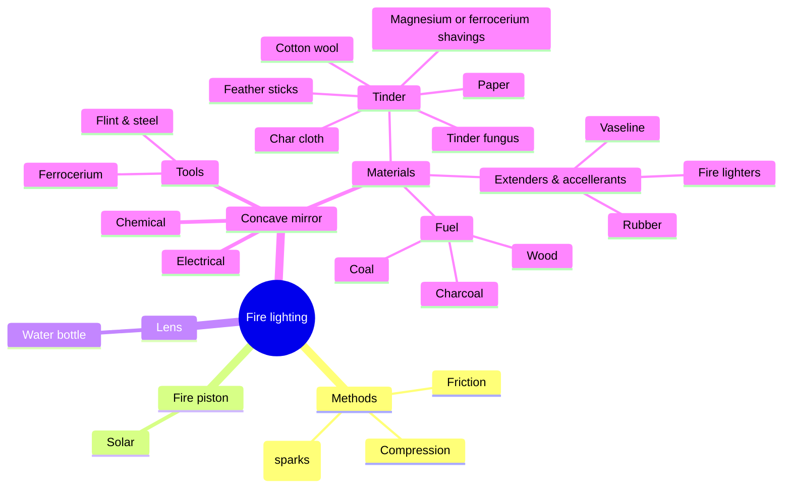

# Fire lighting

Concave mirror
* https://www.philipharris.co.uk/product/physics/waves/light-waves/concave-mirrors-50mm-dia-f200-pack-of-10/pp00054644

Convex lens
* https://www.philipharris.co.uk/product/physics/waves/light-waves/double-convex-spherical-lenses-plus10d,-fl100mm-pack-of-5/b8l27157
